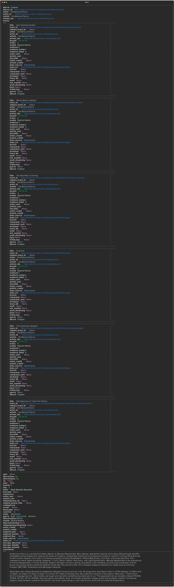
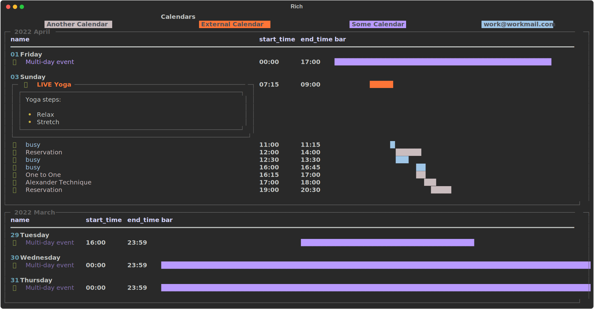
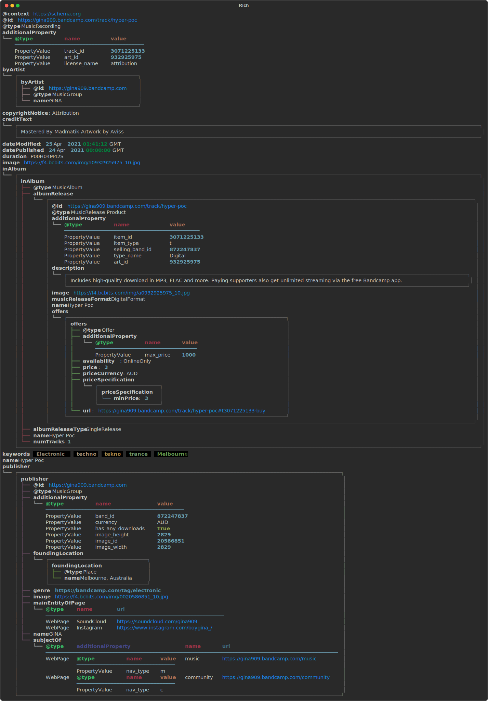
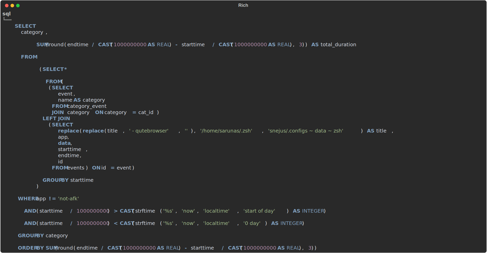

# Rich tables

JSON human-prettifier based on the brilliant [rich](https://github.com/Textualize/rich)
python library.

Since my usual day involves building and interacting with various APIs, JSON data is
constantly flying around the terminal. Reading JSON data (even when it's prettified by,
say, `jq`) requires a fair bit of mental effort; and it's basically impossible to analyse
/ make sense of it just by looking at it.

This project initially started as a way to solve this issue – it takes JSON data as an
input and prints it in _(rich-)tables_, making it somewhat more readable for humans. With
time, it's become the main handler for most of structured data that gets displayed in my
terminal and is now one of my core every day tools.

## Releases

It's WIP but installable through pip: `pip install rich-tables` – feel free test it but do
not expect it to be stable yet.

If we have enough interest, I am more than happy to prepare a release with a somewhat
stable API.

## Some bits to be aware of

##### Most commits are made by a daily cron job

You will find commits named

    Automatic backup <date>

There is a daily cronjob which checks my local copy of the repository for changes,
commits, and pushes them upstream.

It got setup because this entire thing got built without intention – whenever I came
across data that was not handled by `rich-tables`, I opened the code, quickly added the
logic and continued on with the original work without committing. Eventually, I'd have to
deal with a huge diff with a lot of unrelated changes.

##### Tests simply attempt to render data in each test case without making any assertions

- At least at this point I only want to know whether every piece of data is rendered fine.

##### For each `tests/json/<name>.json` test case, the rendered output is saved to `svgs/<name>.svg` file

- Allows to see the visual difference a certain change makes
- Helps to detect unintended side effects: if we're expecting an update of `album.svg`
  **only** but see that `pr.svg` is also updated, we know something's not right
- In commit details, GitHub shows visual difference for `svg` file changes
  - This is very helpful when one is trying to track down the culprit behind some missing
    border

##### README is populated with pictures dynamically when tests pass

- Once tests finish successfully, a subsection is added for every picture in the `svgs/`
  folder (in the alphabetical order). `case.svg` would be found under the subsection
  `Case`.
- This logic lives in [a session-scoped `pytest`
  fixture](https://github.com/snejus/rich-tables/blob/e25ac771a543b160c40dbed0764b579f0983a4c0/tests/test_outputs.py#L21-L33),
  after the `yield` statement.

## Examples

### Album

### Albums

### Calendar

### Diff

### Emails

### Hue

### Jira diff

### Music list

### Nested JSON

### Pr

### Simple JSON

### Sql

### Tasks

### Text diff

### Timed

