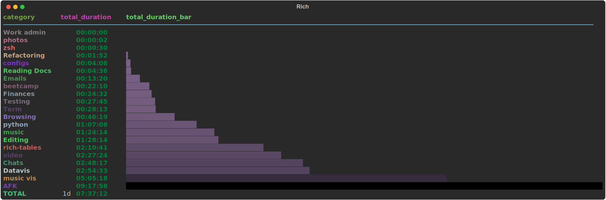
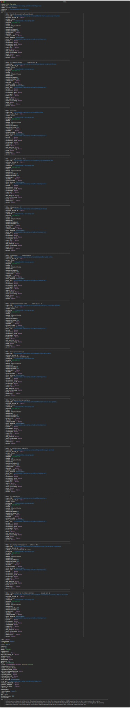

# Rich tables

* [Album](#album)
* [Emails](#emails)
* [Pr](#pr)
* [Timed](#timed)
* [Simple json](#simple_json)
* [Nested json](#nested_json)

## Album

## Emails

## Pr

## Timed

## Simple_json

## Nested_json

