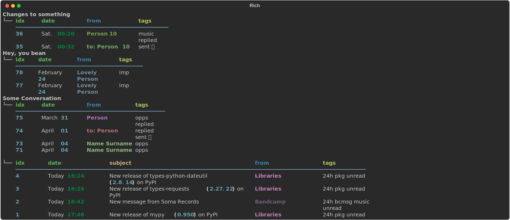
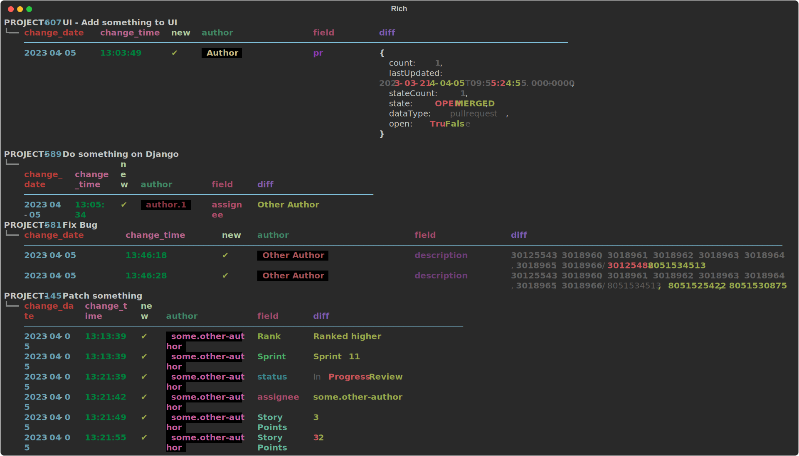
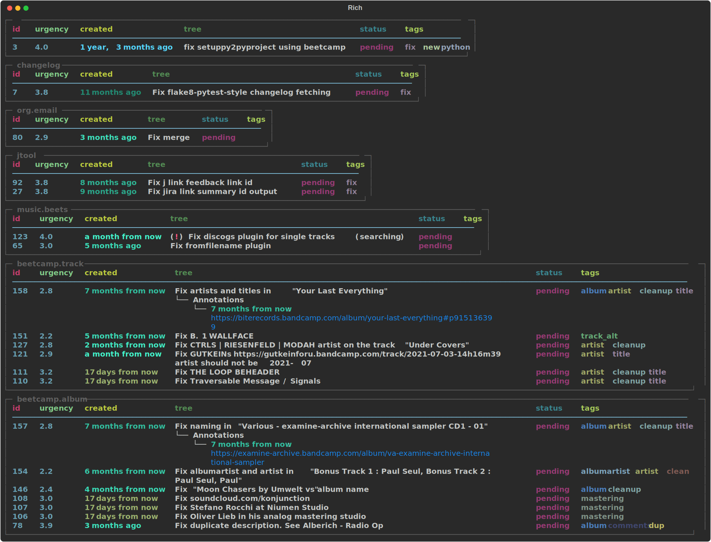

# Rich tables

* [Album](#album)
* [Calendar](#calendar)
* [Emails](#emails)
* [Hue](#hue)
* [Jira diff](#jira_diff)
* [Nested json](#nested_json)
* [Pr](#pr)
* [Simple json](#simple_json)
* [Tasks](#tasks)
* [Timed](#timed)

## Album

## Calendar

## Emails

## Hue

## Jira diff

## Nested json

## Pr

## Simple json

## Tasks

## Timed

